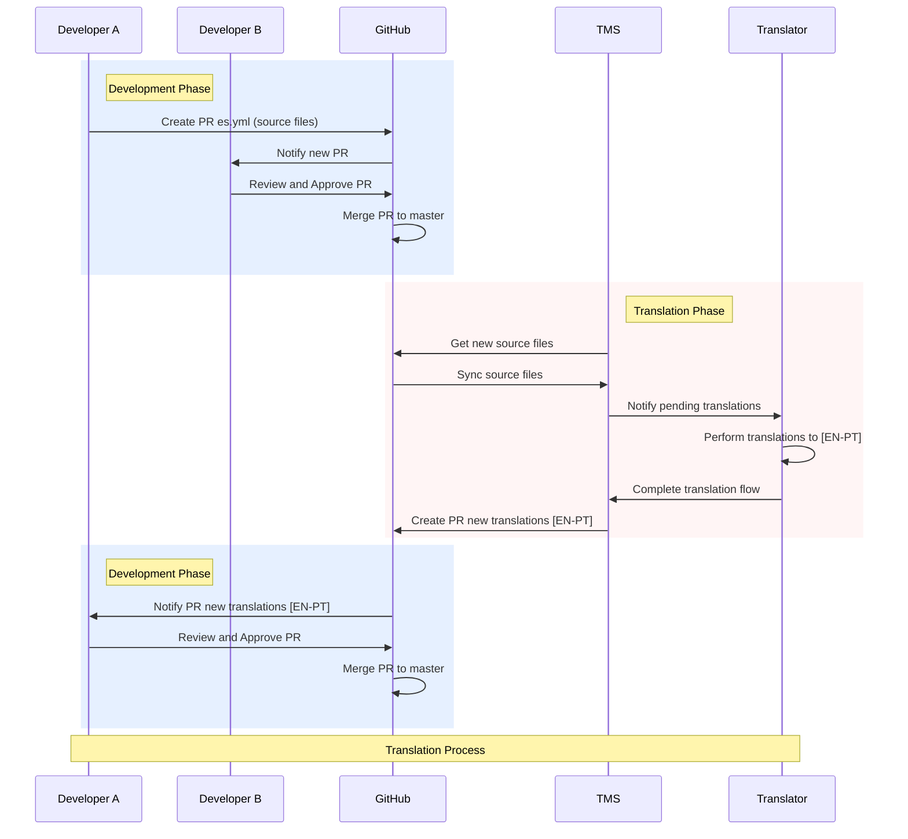

# File Translation Process

This document describes the workflow for translating language files in our system.

## Overview

The translation process follows a sequential flow involving different actors and systems:
- Developers (A and B)
- GitHub as version control system
- Translation Management System (TMS)
- Translator

## Process Phases

### 1. Initial Development Phase
- Developer A creates a Pull Request (PR) with source files in Spanish (es.yml)
- GitHub notifies Developer B about the new PR
- Developer B reviews and approves the PR
- GitHub merges PR into master branch

### 2. Translation Phase
- TMS retrieves new source files from GitHub
- GitHub syncs source files with TMS
- TMS notifies Translator about pending translations
- Translator performs translations to English and Portuguese [EN-PT]
- Translator completes translation flow in TMS
- TMS creates PR with new translations [EN-PT]

### 3. Final Development Phase
- GitHub notifies Developer A about PR with new translations
- Developer A reviews and approves PR
- GitHub merges translations PR into master branch

## Sequence Diagram

[The sequence diagram](/docs/assets/seq-diagram.en.png) shows the complete translation process flow, including all interactions between the different actors and systems involved.

## Important Notes
- Source files are always in Spanish (es.yml)
- Translations are done to English and Portuguese [EN-PT]
- Each phase is clearly delimited and requires approval before moving to the next one
- The process is automated through GitHub and the Translation Management System