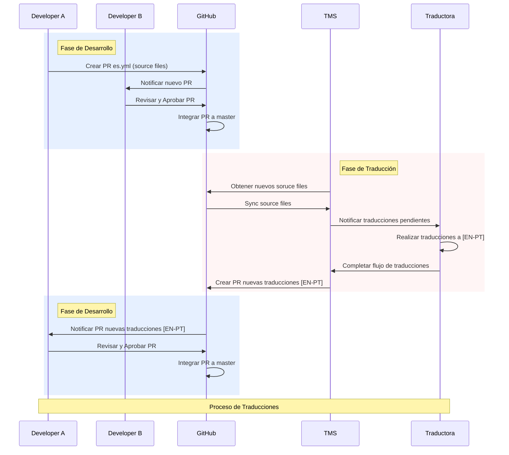

# Proceso de Traducción de Archivos

Este documento describe el flujo de trabajo para la traducción de archivos de idioma en nuestro sistema.

## Descripción General

El proceso de traducción sigue un flujo secuencial que involucra a diferentes actores y sistemas:
- Desarrolladores (A y B)
- GitHub como sistema de control de versiones
- Sistema de Gestión de Traducciones (TMS)
- Traductora

## Fases del Proceso

### 1. Fase de Desarrollo Inicial
- El Desarrollador A crea un Pull Request (PR) con los archivos fuente en español (es.yml)
- GitHub notifica al Desarrollador B sobre el nuevo PR
- El Desarrollador B revisa y aprueba el PR
- GitHub integra los cambios a la rama master

### 2. Fase de Traducción
- El Sistema de Gestión de Traducciones (TMS) obtiene los nuevos archivos fuente de GitHub
- TMS sincroniza los archivos fuente
- TMS notifica a la Traductora sobre las traducciones pendientes
- La Traductora realiza las traducciones a inglés y portugués [EN-PT]
- La Traductora completa el flujo de traducciones en el TMS
- TMS crea un PR con las nuevas traducciones [EN-PT]

### 3. Fase de Desarrollo Final
- GitHub notifica al Desarrollador A sobre el PR con las nuevas traducciones
- El Desarrollador A revisa y aprueba el PR
- GitHub integra las traducciones a la rama master

## Diagrama de Secuencia

[El diagrama de secuencia](/docs/assets/seq-diagram.es.png)  muestra el flujo completo del proceso de traducción, incluyendo todas las interacciones entre los diferentes actores y sistemas involucrados.

## Notas Importantes
- Los archivos fuente siempre están en español (es.yml) o español variante país (es-mx.yml, es-cl.yml, etc.)
- Las traducciones se realizan a inglés y portugués [EN-PT]
- Cada fase está claramente delimitada y requiere aprobación antes de pasar a la siguiente
- El proceso está automatizado a través de GitHub y el Sistema de Gestión de Traducciones