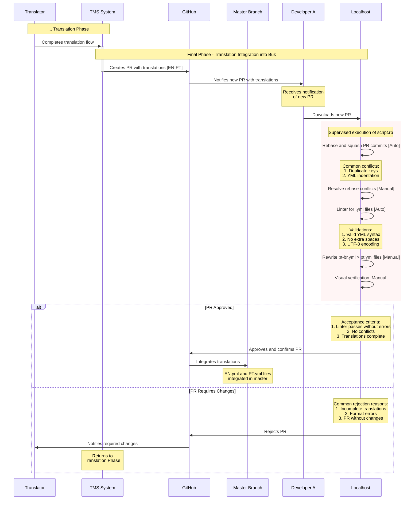

# Translation Integration Phase

This document describes the process of managing translations from the TMS system to their integration into the main repository branch.

## Overview

The workflow involves multiple actors and systems:
- Translator
- TMS (Translation Management System)
- GitHub
- Developers
- Local Environment

## Process Phases

### 1. Translation Phase

1. Translator completes the translation flow in TMS.

### 2. Final Development Phase - Pull Request Review

1. TMS automatically creates a Pull Request (PR) on GitHub with translations [EN-PT].
2. GitHub notifies assigned developer about new PR.
3. Developer downloads PR to local environment.

### 3. Local Review Process

Developer must run a supervised script (`script.rb`) that performs:

#### Automated Actions:
- Rebase and squash PR commits
- Run linter on .yml files

#### Manual Actions:
- Resolve rebase conflicts
- Rewrite `pt-br.yml` files to `pt.yml`
- Final visual verification

#### Common Conflicts:
1. Duplicate keys
2. YML indentation issues

#### Linter Validations:
1. Valid YML syntax
2. No extra spaces
3. Correct UTF-8 encoding

### 4. Acceptance Criteria

To approve PR:
1. Linter passes without errors
2. No conflicts exist
3. Translations are complete

### 5. Resolution Flows

#### Approved PR:
1. Developer approves and confirms PR on GitHub
2. Translations integrate into master branch
3. `EN.yml` and `PT.yml` files integrate into main branch

#### PR Requires Changes:
1. Developer rejects PR on GitHub
2. Translator is notified of required changes
3. Process returns to Translation Phase

#### Common Rejection Reasons:
1. Incomplete translations
2. Format errors
3. PR without changes

## Sequence Diagram
The sequence diagram shows the flow in its last phase where the review of a new Pull Request for Translations is performed.

## Important Notes

- YML file format consistency is crucial (source and target files)
- Manual verification ensures translation quality
- Process designed to maintain translation integrity throughout