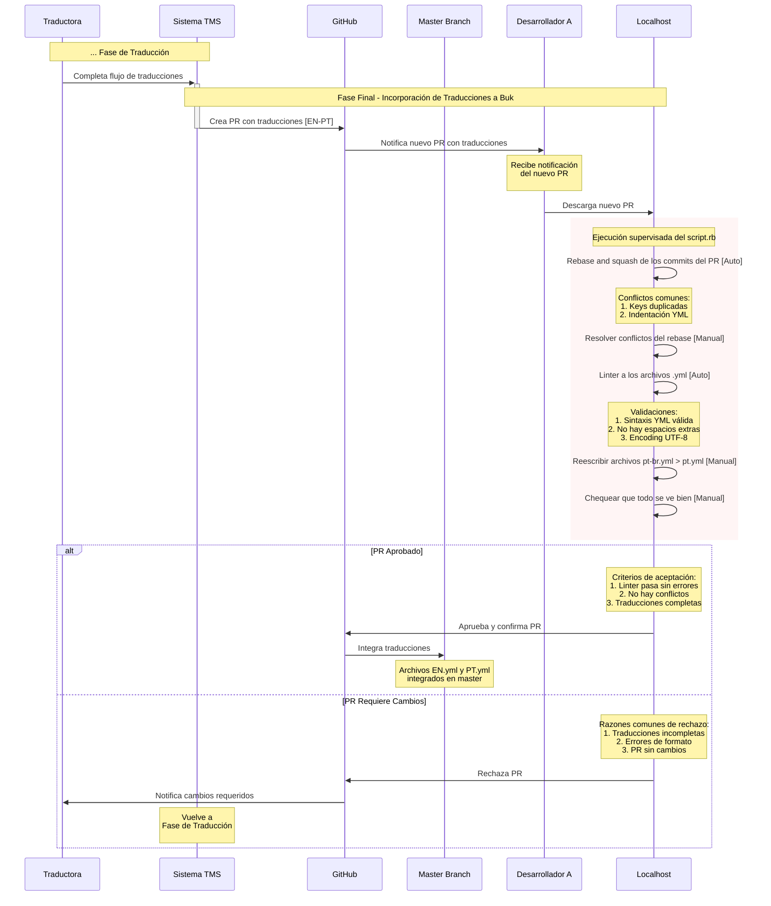

# Fase de Incorporación de Traducciones

Este documento describe el proceso de gestión de traducciones desde el sistema TMS hasta su integración en la rama principal del repositorio.

## Descripción General

El flujo de trabajo involucra múltiples actores y sistemas:
- Traductora
- Sistema TMS (Translation Management System)
- GitHub
- Desarrolladores
- Ambiente Local

## Fases del Proceso

### 1. Fase de Traducción

1. La traductora completa el flujo de traducciones en el sistema TMS.

### 2. Fase de Desarrollo Final - Revisión Pull Request

1. El sistema TMS crea automáticamente un Pull Request (PR) en GitHub con las traducciones [EN-PT].
2. GitHub notifica al desarrollador asignado sobre el nuevo PR.
3. El desarrollador descarga el PR en su ambiente local.

### 3. Proceso de Revisión Local

El desarrollador debe ejecutar un script supervisado (`script.rb`) que realiza las siguientes acciones:

#### Acciones Automatizadas:
- Rebase y squash de los commits del PR
- Ejecución del linter en archivos .yml

#### Acciones Manuales:
- Resolución de conflictos del rebase
- Reescritura de archivos `pt-br.yml` a `pt.yml`
- Verificación visual final

#### Conflictos Comunes:
1. Keys duplicadas
2. Problemas de indentación en archivos YML

#### Validaciones del Linter:
1. Sintaxis YML válida
2. Ausencia de espacios extras
3. Encoding UTF-8 correcto

### 4. Criterios de Aceptación

Para aprobar el PR, se deben cumplir los siguientes criterios:
1. El linter pasa sin errores
2. No existen conflictos
3. Las traducciones están completas

### 5. Flujos de Resolución

#### PR Aprobado:
1. El desarrollador aprueba y confirma el PR en GitHub
2. Las traducciones se integran en la rama master
3. Los archivos `EN.yml` y `PT.yml` quedan integrados en la rama principal

#### PR Requiere Cambios:
1. El desarrollador rechaza el PR en GitHub
2. Se notifica a la traductora sobre los cambios requeridos
3. El proceso vuelve a la Fase de Traducción

#### Razones Comunes de Rechazo:
1. Traducciones incompletas
2. Errores de formato
3. PR sin cambios

## Diagrama de Secuencia

El diagrama de secuencia muestra el flujo en su última fase dónde se realiza la revisión de un nuevo Pull Request de Traducciones.

## Notas Importantes

- Es crucial mantener la consistencia en el formato de los archivos YML (source files y target files)
- La verificación manual es necesaria para garantizar la calidad de las traducciones
- El proceso está diseñado para mantener la integridad de las traducciones en todo momento
